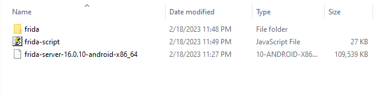
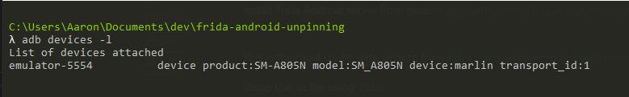
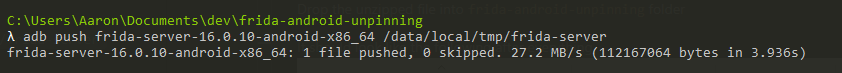
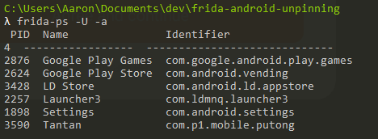
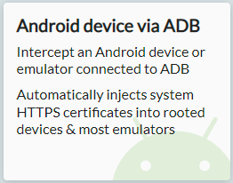

## **Prequisites**

* Cmder
* Python
* 7zip
* Apktools

For more context, this tutorial is following similar steps to this post originally from HttpToolkit's blogspot, however under Windows

The endgoal of this tutorial is to be able to look into HTTPS requests for an Android app that has been SSL pinned.


## **LDPlayer9 Installation**

First we're going to need an Android emulator

Download and install [LDPlayer9](https://www.ldplayer.net/) OR use the [direct download link](https://ldcdn.ldmnq.com/download/ldad/LDPlayer9.exe?n=LDPlayer9_ens_1001_ld.exe)


Open the emulator, and it should look like this when started, minus the apps I have already installed 


Once you have it installed, go to the `Settings` page under the gear icon on the right side menu


It should open up to a screen like this


Under `Other settings`, set the following options:

Root permission: `Enable`  
ADB debugging: `Open local connection`


Click `Save settings` and it'll ask you to restart the emulator

Finally, you should drag and drop your `.apk` file into anywhere on the emulator screen.  
Once it appears on your home screen, open up the application.

## **Frida** 

**TL;DR**: Frida allows us to bypass SSL pinning

Clone this repository: https://github.com/httptoolkit/frida-android-unpinning

```bash
git clone git@github.com:httptoolkit/frida-android-unpinning.git
```

Change directory into the cloned repository

```bash
cd frida-android-unpinning
```

Create a virtual environment

```bash
python -m venv frida
```

Activate the virtual environment

```bash
frida\Scripts\activate.bat
```

Install frida-tools

```bash
pip install frida-tools
```

Make sure `frida-tools` was installed by running `frida-ps`

```bash
frida-ps
```

## Frida Server

Install Frida Android server from [here](https://github.com/frida/frida/releases/download/16.0.10/frida-server-16.0.10-android-x86_64.xz)

**Note**: We're using `x86_64` version because we're going to be using `LDPlayer9` 

The current version as of this tutorial is `16.0.10`. Check for the most up-to-date version from https://github.com/frida/frida/releases

Unzip the `.xz` file using `7zip`

Drop the unzipped file into `frida-android-unpinning` folder

It should look like the following after everything



Make sure your emulator is visible 

```bash
adb devices -l
```



Start the emulator as root
```bash
adb root
```


```bash
adb push frida-server-16.0.10-android-x86_64 /data/local/tmp/frida-server
```




```bash
adb shell "chmod 755 /data/local/tmp/frida-server"
```


Start the frida server. You shouldn't see any errors if it started correctly

```bash
adb shell "/data/local/tmp/frida-server &"
```


Open up another terminal

Find the app identifier after opening the app
```bash
frida-ps -U -a
```



In my case, it is `com.p1.mobile.putong`

```bash
frida -U -l ./frida-script.js -f com.p1.mobile.putong
```


**HTTPToolkit**

Install the community edition of HTTPToolkit: https://httptoolkit.com/download/win-exe/

It should automatically start downloading

Once installed it should look like this


Click `Android device via ADB`



Go to LDPlayer9, and allow the connection to be made


Open the app you want to monitor traffic for again

Finally, you should the requests populate on HTTP HttpToolkit


