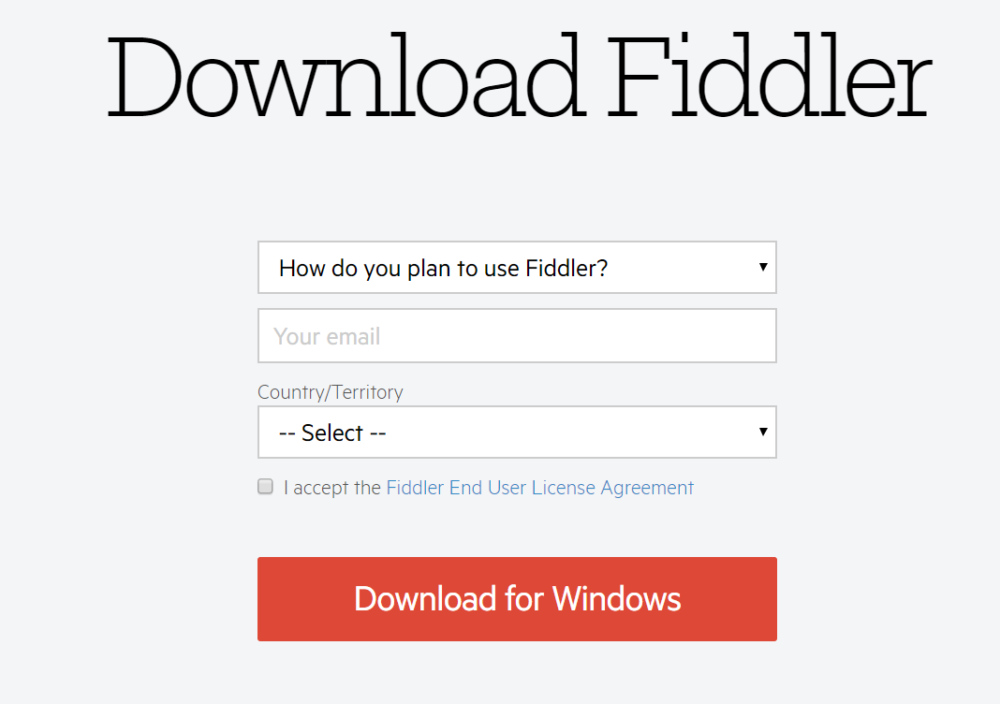
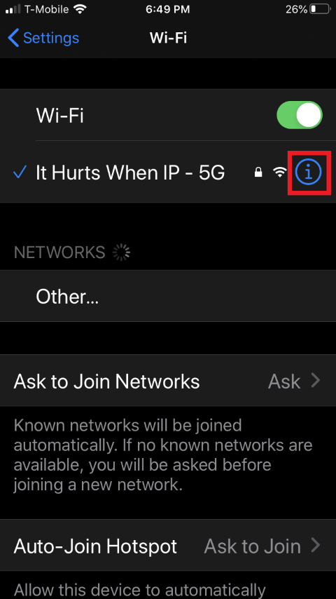
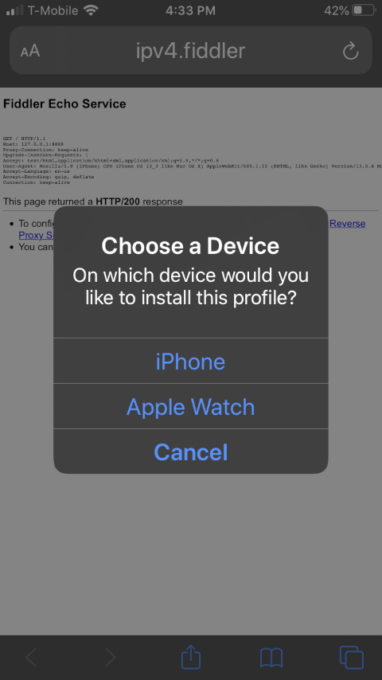
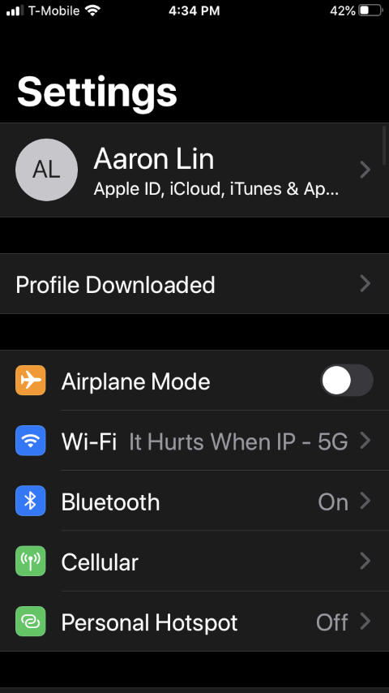
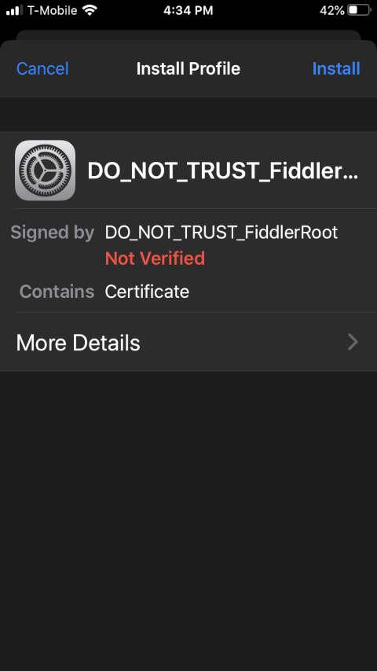
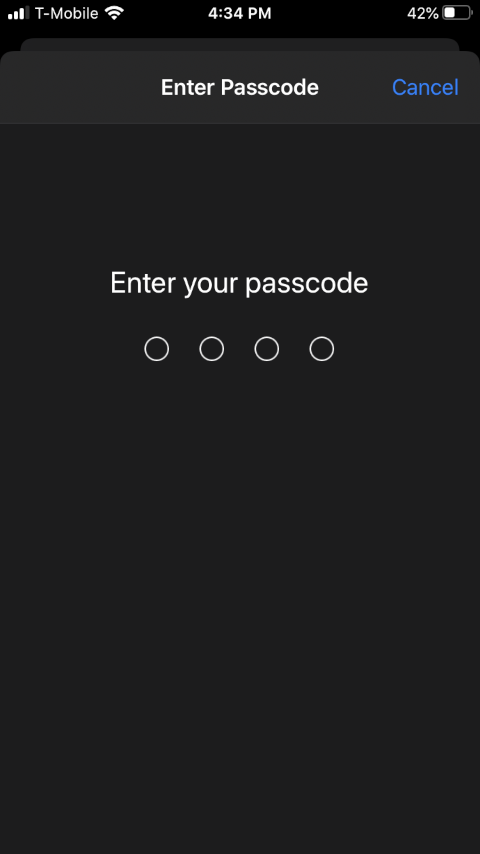

This is my first guide on setting up Fiddler.  
The documentation on Fiddler site is pretty good but but they're missing a little something.  
This guide is focused on getting a Windows machines looking at iPhone's mobile traffic.  
There will be some blog posts in the future where I use Fiddler so I think it's a good start for anyone who wants to try it themselves  

Why should you use Fiddler? Well it's a good way to look at your mobile phone's traffic  
An example, see how some of your apps interact by calling a backend and you can sometimes reverse engineer these backend calls on Postman  

If you ever used Charles proxy or WireShark, it is essentially the same thing  
I didn't have much luck with Charles proxy on Windows so this can serve as an alternative to it,
plus Charles proxy has a 30 day trial period while Fiddler is entirely free.

> Okay, you got me convinced! How do I set it up?

**_Disclaimer_**: This is done on a Windows 10 machine & iPhone 8 on iOS 13.3

## **Windows PC configuration**

1. Start by downloading Fiddler from this [site](https://www.telerik.com/download/fiddler)  
   Enter how you're planning to use Fiddler, your email, and country and accept the Fiddler End User Agreement
   

2. Open **FiddlerSetup.exe** and click **Yes**
   

3. Accept license with **I agree**  
   

4. Install location folder location and click **Install**  
   

5. Download the [Certificate Maker plugin](https://telerik-fiddler.s3.amazonaws.com/fiddler/addons/fiddlercertmaker.exe) for Fiddler

6. Open **fiddlercertmaker.exe** and click **Yes**
   

7. Installation complete message, hit **OK**
   

8. Open Fiddler, press **Cancel** for AppContainer message  
   

9. Enable HTTPS traffic decryption

   - Go to **Tools > Options... > HTTPS**
   - Click checkbox **Decrypt HTTPS traffic**
   - Hit **OK** on the **Options** window
     

10. Allow remote computers to connect

    - Go to **Tools > Options... > Connections**
    - Click checkbox **Allow remote computers to connect**
      
    - Hit **OK** from popup window
      
    - Hit **OK** on the **Options** window

11. Restart Fiddler

12. Ensure your firewall allows incoming connections to the Fiddler process, and that it's not blocking all incoming connections, including those in the list of allowed apps.

13. Hover over the Online indicator at the far right of the Fiddler toolbar to display the IP addresses assigned to Fiddler's machine. Note this down for step 17. Usually this is the bottommost IP address if you have multiple IP addresses
    

## **iPhone device configuration**

14. Go to **Settings > Wi-Fi**

15. Find your current network and click the (i) icon
    

16. Scroll to the bottom and open up **HTTP Proxy**

17. Choose **Manual**, type your IP address in the **Server** field and type the Fiddler listening port (8888 by default) in the **Port** field. Keep **Authentication** off
    

18. Hit **Save**

19. Go to Safari. It has to be Safari, not Chrome! Open up http://ipv4.fiddler:8888
    

20. Click FiddlerRoot certificate. Click **Allow**
    

21. If there is a prompt, choose **iPhone** for device to download this certificate to
    

22. Click **Close** for Profile Downloaded
    

23. Click on **Profile Downloaded** under **Settings** in your iPhone
    

24. Click **Install** for the DO_NOT_TRUST_FiddlerRoot profile
    

25. Enter your passcode if you have one
    

26. Hit **Install** when warning message comes up and click **Install** again
    

27. Click **Done** afterwards for Profile Installed

28. Go to **Settings > About > Certificate Trust Settings**. It should be located at the bottom

29. Turn on the Certificate you downloaded. Click **Continue** for Root Certificate warning
    

30. You're done! When you go to any site or app, you should now see traffic being logged into the Fiddler app on your desktop

31. You can turn this off by going to the **HTTP Proxy** in the Wi-Fi and configure the proxy to **Off**

Hopefully this guide has helped you out. I wanted to make this guide as a way to guide others and remind myself if I need to re-install Fiddler.  

Let me know what you think!
