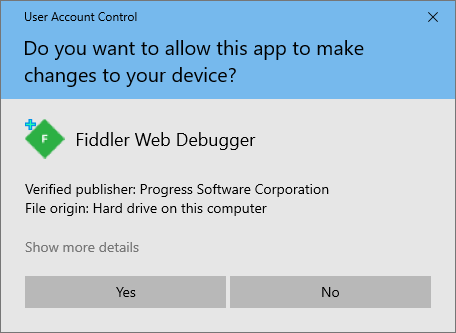
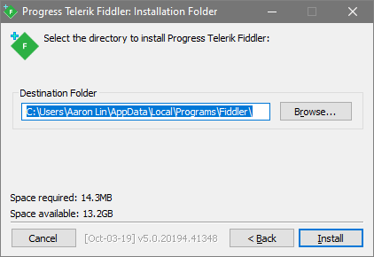

This is my first guide on setting up Fiddler.  
Bear with me in my journey making meaningful blog posts and tutorials  
There will be some blog posts where I use Fiddler so I think it's a good start for anyone who wants to try it themselves  

Why should you use Fiddler? Well it's a good way to look at your mobile phone's traffic
An example, see how some of your apps interact by calling a backend and you can sometimes reverse engineer 
these backend calls on Postman

If you ever used Charles proxy or WireShark, it is essentially the same thing
I didn't have much luck with Charles proxy on Windows so this can serve as an alternative to it, 
plus Charles proxy has a 30 day trial period while Fiddler is entirely free.

> Okay, you got me convinced! How do I set it up?

***Disclaimer***: This is done on a Windows 10 machine
    iPhone 8 on iOS 13.3

The documentation on Fiddler site is pretty good but this guide is focused on getting a Windows machines looking at iPhone's mobile traffic.

1. Start by downloading Fiddler from this [site](https://www.telerik.com/download/fiddler)  
Enter how you're planning to use Fiddler, your email, and country and accept the Fiddler End User Agreement

2. Open **FiddlerSetup.exe** and click **Yes**

3. Accept license with **I agree**  

4. Install location folder location and click **Install**  

5. Download the [Certificate Maker plugin](https://telerik-fiddler.s3.amazonaws.com/fiddler/addons/fiddlercertmaker.exe) for Fiddler

6. Open **fiddlercertmaker.exe** and click **Yes**

7. Installation complete message, hit **OK**

8. Open Fiddler, press **Cancel** for AppContainer message  

9. Enable HTTPS traffic decryption
    - Go to **Tools > Options... > HTTPS**  
    - Click checkbox **Decrypt HTTPS traffic**
    - Hit **OK** on the **Options** window
    

10. Allow remote computers to connect 
    - Go to **Tools > Options... > Connections**  
    - Click checkbox **Allow remote computers to connect**
    
    - Hit **OK** from popup window
    
    - Hit **OK** on the **Options** window

11. Restart Fiddler

12. Ensure your firewall allows incoming connections to the Fiddler process, and that it's not blocking all incoming connections, including those in the list of allowed apps.

13. Hover over the Online indicator at the far right of the Fiddler toolbar to display the IP addresses assigned to Fiddler's machine. Usually this is the bottommost IP address  

14. Now moving onto the iPhone device

15. Go to **Settings > Wi-Fi**

16. Find your current network and click the (I) icon

17. Scroll to bottom and choose **Manual** on the **HTTP Proxy** choice

18. Type your IP address in the **Server** field

Settings > Wi-Fi > Click the Information icon > HTTP Proxy > Configure Proxy > 

19. Type the Fiddler listening port (8888 by default) in the **Port** field

Configure the device where Fiddler is installed to trust Fiddler root certificate

20. Go to Safari. It has to be Safari, not Chrome! Open up http://ipv4.fiddler:8888

Accept

Configure iPhone WiFI manual proxy to be your IP and port 8888

