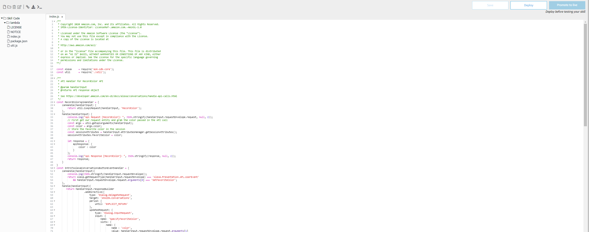

There are plenty of tutorials out there for building Alexa Skills since it's introduction in 2014.

As of today, there seems to be better and better ways to get your environment setup for development quickly.
This tutorial is going to go over a relatively new feature in the Alexa dashboard to integrate with Visual Studio Code.

Let's get started!

1. Log onto the [Alexa Dashboard](https://developer.amazon.com/alexa/console/ask).
   Create an account if you haven't already

2. Click `Create Skill` 
 

3. Enter any skill name and keep the rest as default

4. Choose your template - you can go simple with Hello World or go with a more complicated template to see how those are built.

5. Continue and wait for your skill to be generated. This can take several minutes.

6. Once the skill is generated, it'll auto redirect you to the skill dashboard. 
   Lets click on the Code tab

7. Click the console icon and `Export to VS Code`
   It'll prompt you to open Visual Studio Code. 
   

8. Allow access and then click the `Sign In` button on the tab that appears in VS Code. 

9. Go through the steps to allow access

10. Head back to Visual Studio Code when you hit this screen

11. Alexa Skills Kit (ASK) Toolkit should've been auto installed

12. If you haven't been redirected correctly, go back to the skill dashboard and hit export to VS Code again
It should ask which folder to download the skill to

13. This is the screen that should appear if everything has been done correctly.

14. Time to start coding. There will be a part 2 for the features in the ASK toolkit

